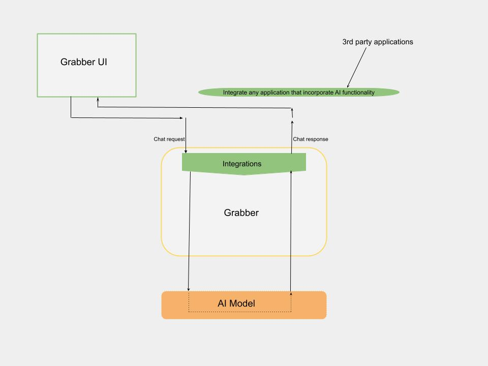
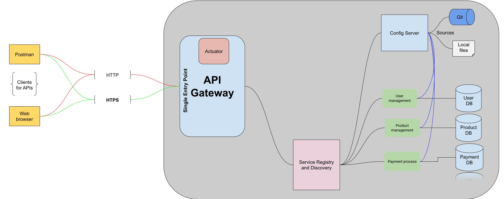

### AI Integration (LLM)

    

#### Technology 

#### 🔨 Tools

	<code>
        
    </code>
	<code>
        
    </code>

### Microservices API Gateway

    

#### Technology 

#### 🔨 Tools

	<code>
        
    </code>
	<code>
        
    </code>

