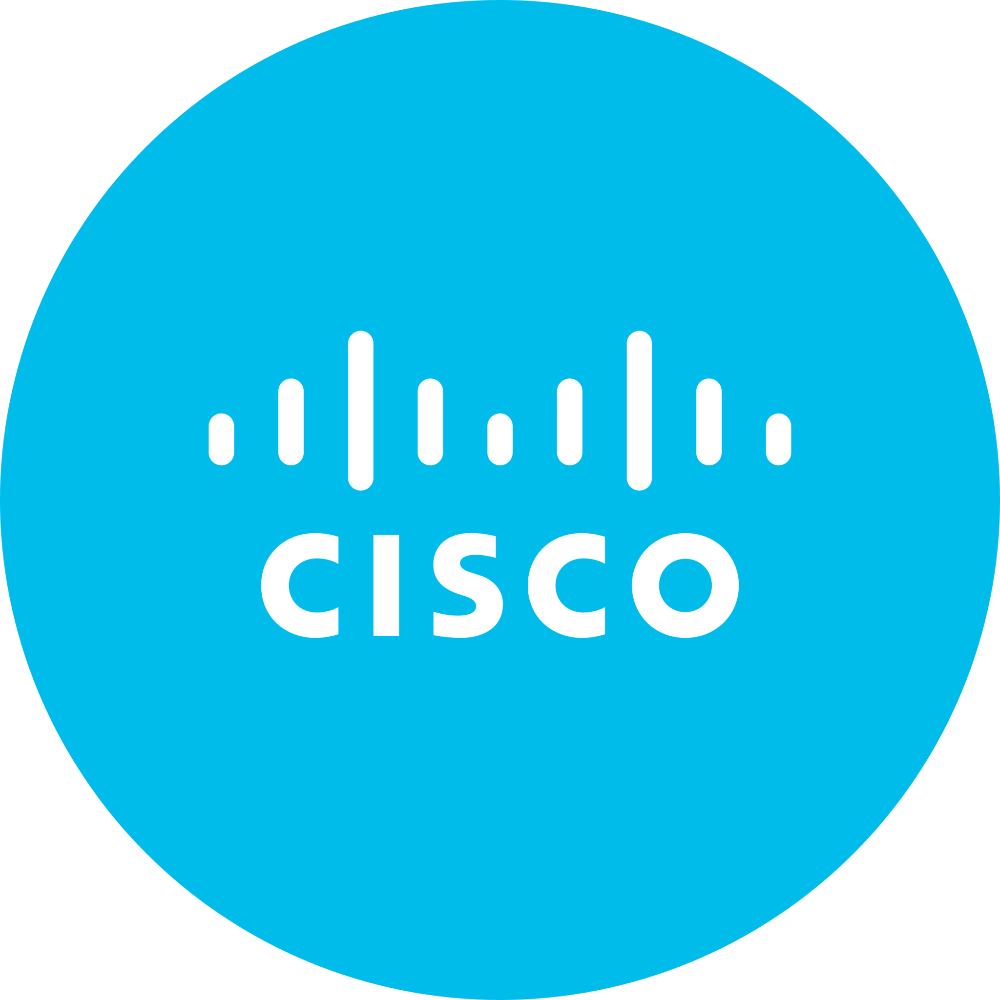
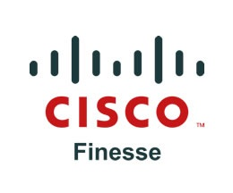

## About Me 😎

<!--
**malik-irfan/malik-irfan** is a ✨ _special_ ✨ repository because its `README.md` (this file) appears on your GitHub profile.

Here are some ideas to get you started: -->

- 🔭 I’m a Software Developer / IVR Analyst
- 🦚 Currently working to grow Mannai in software industory.
- 🌱 I’m currently learning microservices, Conversational AI, and CC tech...
<!-- - 👯 I’m looking to collaborate on ...
*- 🤔 I’m looking for help with ...
- 💬 Ask me about ...
- 📫 How to reach me: ...
- 😄 Pronouns: ...
- ⚡ Fun fact: ...
-->

 &nbsp;&nbsp;
  &nbsp;&nbsp;

  📫 How to reach me: <a href='mailto:m.irfanawan77@gmail.com'>m.irfanawan77@gmail.com</a>

## Skills
- Cisco UCCE, PCCE
- Genesys Cloud CX (Administration, Implementation,SIP,IVR,ACD Routing and Integration)
- IVR Applications Development (Genesys/CISCO), CRM/3rd party system Integrations,Inbound,Outbound,In-Queue,Email and Chat.
- Dialog Flow CX, Conversational AI, Chatbots, UCaaS, CCaaS.
- Dashboard,Reports(CUIC/Custom), Finesse Gadget Development
- Java, JEE,Spring boot, Java,OOP Script, Voice XML, Node Js, JSON,DB
- Microservices REST/SOAP, Java Standalone Apps,
- HTML,CSS,JQuery,BootStrap,Angular,Android,Google map API,Firebase
- MS-SQL,MS Visio,MS Office,Wireshark, Apache Tomcat,IIS,Task Scheduler
- Eclipse,Intellij,NetBean,Visual Studio,Webex,Microsoft Team
- Git,Github, Jira Confluence,Fresh desk, Verint, 

  
📃 Resume

## Experience

### Telecom & Network Consultant

    
 <bold>📆 2023 - Present </bold> 

    
 <bold>📍 Mannai Corporation QPSC</bold> 

Leading the call center operations with expertise in IVR applications, Adapter development, report generation(CUIC/Custom) and ensuring smooth UCCE/PCCE and NOC support. Build dynamic IVR call flows integrated with CRM, Verint and 3rd party system, an adapter connecting Freshchat and Verint, reports on customer requirements,handling databases. Build conversation AI chatbot Google dialog flow CX - VXML, Java,JSON,Cisco CUIC,MS SQL,Transact-sql 

### Senior Project Engineer Voice

    
 <bold>📆 Dec 21 - Jan 22 </bold> 

    
 <bold>📍 Mindbridge</bold> 

Worked with the Mindbridge and Telenor team to oversee the projects comprehensively. Project requirements, designing, developing, testing and deployment. Developed 4 IVR applications and 7+ revamped which decreased 45% agent utilization, dashboard to show customer interaction history.   - VXML, Java,JSON,Cisco CUIC,MS SQL,Transact-sql,Node Js

### Project Development Specialist 

    
 <bold>📆 Jul 18- Nov 21 </bold> 

    
 <bold>📍 MExpertflow</bold> 

Developed 13+ IVR applications (Self Service, Integrated CRM/3rd party), One Window Finesse Gadget(integrated with multiple backend systems), 7+ Adapters & Microservices. -  VXML, Java,Node Js, Angular, HTML, CSS, Java Script, REST/SOAP, DB,SP,Transact-sql, Docker.  (PTCL, Telenor, Bank Misr, MCB, KCB Bank Kenya)

## Education

- 📖 **Bachelor of Computer Science**\
📆 2013 - 2017\
📍 **University of Sargodha** - Punjab, Pakistan

<!-- Project Detail -->

  
📃 Projects

## Freshchat Text Interaction Capture Adapter
📆 2024

**What is it?**\
The Verint Freshchat Adapter provides organization with the ability to ingest Freshchat messaging, chat interactions into the Verint for use throught the suite of Verint applications.

**How does it work?**\
The Verint Freshcaht Text Interaction Adapter is an out-of-box capability that supports extraction of interaction data from Freshchat APIs and ingestion into Verint EDM.

Once configured, the adapter connects to Freshchat and brings text interactions into Verint EDM in near real-time. Once interactions are available within Verint EDM, they will be normalized among other EDM Interactions and seamlessly available for Search, Replay, Quality Monitoring, Text Analytics any other Verint applications which utilize captured interactions.

The Freshchat Text Interaction Adapter is built with features which ensure that data is not lost and extract data for specific channel. 

**What is required to implement?**\
To implement the Freshchat Interaction Adapter, customer need:
* Freshchat Cloud Environment, Freshchat Messaging
* Verint Engagement Data Management (in addition, Verint Quality Monitoring and Verint Text Analytic)
* API keys and associated configuration values for Freshchat and Verint EDM and/or Text Analytics

    

**What are the benifits?**\
The Freshchat Text Interaction Adapter key benifits:\
* Help organization manage all their customer interactions in one place through Verint Engagement Data Management (EDM)
* Allow organizations to use Verint Quality Management to evaluate the quality of those interactions which occur through Freshchat communication platform
* Enable Verint Text Analytics to process Freshchat Chat interactions and gain insights through sentiment analysis, categorization, and key driver analysis

#### 🔨 Tools & Technology

  

## Genesys Cloud CX Integration with Google Dialogflow
📆 2024

**What is it?**\
The integration of Google Cloud Dialogflow within Genesys Cloud enables the use of Natural Language Understanding (NLU) to enhance inbound customer interactions. This solution allows customers to communicate naturally, helping the system better understand their intent and quickly route the interaction to a skilled agent when needed.

**How does it works?**\
Google Dialogflow, as a powerful Virtual Agent, is trained with specific data to recognize and understand customer intents during interactions. In this implementation, the Dialogflow bot is specifically trained to handle real estate-related queries, providing quick responses to common questions and tasks, such as property information, availability, and pricing. The system also includes a fallback mechanism that transfers the interaction to a live agent if the bot cannot resolve the query or if more complex assistance is needed.

Once integrated with Genesys Cloud, the Dialogflow bot is incorporated into the Architect call flows, allowing the system to call the bot when an inbound interaction occurs. This seamless integration ensures that customers can interact with the bot through a natural conversation, reducing the time needed to connect with agents while still offering the option for human assistance when necessary.

## Developed/Managed 30+ Reports & Dashboards (CUIC / Custom)
📆 2023-2024

I developed over 30 + reports and dashboards to meet the unique demands of contact center teams. These reports and dashboards were designed to help contact center managers and agents monitor performance metrics in real time, providing key insights into operational efficiency and customer satisfaction. By leveraging CUIC’s ability to fetch data from various Cisco contact center solutions, I tailored the reports and dashboards to meet specific business needs, ensuring they provide actionable insights for better decision-making.

The custom reports were designed to fetch and present data from the contact center’s underlying database, allowing managers to gain detailed insights into call volumes, agent performance, customer satisfaction, and wait times. I enabled the creation of custom queries to retrieve specific data sets, and also ensured that the reports could be easily customized to present relevant data to different stakeholders. This made the reports highly adaptable and accessible to various teams within the organization, from supervisors to top-level management, based on their role and requirements.

The dashboards I developed served as real-time visualization tools, consolidating key performance metrics into a user-friendly interface. These dashboards allowed both agents and managers to quickly assess performance, identify bottlenecks, and make real-time adjustments to improve the customer experience. With these custom dashboards and reports, contact center operations became more streamlined, enabling efficient monitoring of day-to-day activities and empowering teams to provide enhanced service and support.

## 7+ IVR Applications (Telenor Pakistan)
📆 2022

- Telenor Prepaid
- Telenor Postpaid
- Telenor Retailer
- Telenor UAN
- Telenor OB Offers
- Telenor OB VAS
- Telenor Smart Tune Active

**What are these helplines?**\
The Telenor helplines are a series of Interactive Voice Response (IVR) systems designed to streamline customer interactions and provide quick access to various services. They cover a range of customer needs, including prepaid and postpaid services, retailer support, UAN inquiries, and Value Added Services (VAS). These IVR helplines enable customers to resolve issues and access information without needing to speak to an agent, ensuring a faster, more efficient service experience.

**How does these works?**\
Each Telenor IVR helpline is tailored to handle specific customer queries, providing a self-service platform for tasks such as billing inquiries, package details, troubleshooting, and more. When a customer calls, the IVR system quickly guides them to the right option through an intuitive menu, eliminating the need to navigate long, complex menus. For instance, the Telenor Prepaid helpline enables users to manage their prepaid accounts, while the Postpaid and Retailer helplines serve different customer segments with specific queries.

These helplines are fully integrated with Telenor's backend CRM system, third-party solutions, and databases, ensuring that all customer interactions are handled smoothly and accurately. When needed, the system allows customers to connect with a live agent for further assistance. By automating routine processes and offering self-service options, these IVR systems reduce the need for manual intervention, improving efficiency and decreasing average handling time for customer service operations.

#### 🔨 Tools & Technology

  
  
  
  
   

## JBOSS Connector (REST API-based Bridge)
📆 2022

**What is it?**\
Jboss Connector is a REST API-based bridge that facilitates secure communication between Telenor's backend CRM systems, third-party software, and IVR applications. It exposes several APIs that simplify and secure data exchange between various backend systems and front-end IVR solutions.

**How does it works**\
Jboss Connector serves as the intermediary between Telenor’s IVR applications and its backend systems, allowing seamless communication through a secure REST API interface. When an IVR application requires access to data or services from the backend, it sends a request to the Jboss Connector, which securely handles the request and forwards it to the appropriate backend system. The two-way authentication mechanism ensures that the communication remains secure at all times, preventing unauthorized access to sensitive information.

The Jboss Connector abstracts the complexities of the underlying backend systems by providing developers with easy-to-consume APIs, which allows them to focus on building custom solutions without needing to understand the details of the backend technologies. These APIs expose functionalities that can be utilized to integrate various services, such as CRM data retrieval or third-party application interaction, within the IVR workflows. This enhances the flexibility and scalability of the IVR system, making it easier to expand or modify its functionality as business needs evolve.

#### 🔨 Tools & Technology

  
  
  
  

## SMPP Connector
📆 2022

**What is it?**\
The SMPP Connector is a solution designed to enable short messaging functionality for applications using the SMPP protocol. It facilitates communication with SMS centers, SMS gateways, and SMPP gateways for sending SMS messages.

**How does it works?**\
The SMPP Connector uses the SMPP (Short Message Peer-to-Peer) protocol, an open industry standard, to establish communication between applications and Short Message Service Centers (SMSC). This connection allows applications to send and receive SMS messages efficiently by interacting with various messaging entities, including Routing Entities (RE) and Message Centers (MC). The connector enables seamless integration for functionalities such as sending One-Time Passwords (OTPs), billing details, and menu options to customers through SMS.

In the case of Telenor's IVR applications, the SMPP Connector is used to send critical information like OTPs and billing details to customers in real-time. The IVR applications are integrated with this connector, enabling them to deliver messages to customers directly through SMS, improving customer experience and service accessibility without requiring additional manual processes.

#### 🔨 Tools & Technology

  
  

<!-- Projects for PTCL -->

## PTCL 1218 Helpline (IVR Application - Cisco) 
📆 2018-2021

**What is it?**\
PTCL 1218: An Advanced IVR Self-Service Solution for Seamless Customer Support.

**How does it work?**\
PTCL 1218 is an innovative IVR (Interactive Voice Response) solution designed to provide PTCL customers with a seamless self-service experience over the phone. This application enables users to quickly resolve queries without the need for agent intervention, offering a variety of options such as troubleshooting, complaint management, bill inquiries, package details, bill payments, and recharges. Should customers require further assistance, they can easily connect with a live agent.

Internally, the self-service system is organized into distinct modules, each addressing specific customer needs. PTCL 1218 is fully integrated with backend systems through REST APIs and CRM tools, ensuring efficient handling of all customer queries.

Developed using Cisco Call Studio, PTCL 1218 is a VXML application that operates on the Cisco CVP (Customer Voice Portal) server, delivering an enhanced user experience.

#### 🔨 Tools & Technology

  
  
  

## PTCL Post Call Survey (IVR Application - Cisco) 
📆 2018-2021

**What is it?**\
PTCL PCS: A Post-Call Survey Solution for Instant Customer Feedback.
Gathers Insights on Service Quality and Satisfaction for Continuous Improvement.

**How does it work?**\
PTCL PCS (Post Call Survey) works by collecting immediate feedback from customers after their interaction with support agents. Once the call ends, the system prompts the customer to participate in a brief survey, typically consisting of questions about service quality, agent helpfulness, and overall satisfaction. These questions are designed to gauge the customer’s experience and gather actionable insights that can drive service improvements.

The survey is seamlessly integrated with PTCL's CRM systems, ensuring that the feedback is linked directly to specific customer interactions. This integration allows for personalized insights, helping the company better understand customer needs and expectations. The primary goal of PTCL PCS is not only to measure customer satisfaction but also to identify areas for enhancement in service delivery, ultimately improving the overall customer experience.

#### 🔨 Tools & Technology

  
  
  
  
  

## One-Window: A Unified Agent Interface 
📆 2018-2021

**What is it?**\
One Window: Empowering Agents with a Unified Dashboard for Efficient Customer Support.

**How it works and its features?**\
One Window is a comprehensive solution that consolidates multiple customer service modules into a single, unified screen. When a call is connected to an agent, the One Window interface automatically pops up with all relevant customer details, including personal information, billing status, package details, complaints, device status, and more. This integration with backend CRM systems and third-party tools ensures agents have immediate access to the most up-to-date information without switching between multiple windows, significantly reducing search time and minimizing average handling time.

The solution allows agents to perform a variety of tasks directly from the interface, streamlining their workflow and improving efficiency. Key features include:

- Instant customer profile display upon call connection.
- Ability to update customer profiles and change packages.
- Real-time access to complaints status and device information.
- Activation of VAS (Value Added Services) directly from the interface.
- Integration with IVR data, displaying information like IVR menu selections and interaction history. This seamless design enhances the customer service experience by equipping agents with the tools they need to provide fast, informed assistance.

#### 🔨 Tools & Technology

	<code></code>
	<code></code>
	<code></code>
	<code></code>
	<code></code>
	<code></code>
  
  
  
  
  
  

## One-Window-Connector 
📆 2018-2021

**What is it?**\
One Window Connector is a REST API-based bridge that links the One-Window-Gadget with PTCL’s backend CRM systems and third-party software. It provides secure, easy access to various backend services through a unified API layer.

**How does it works?**\
One Window Connector acts as an intermediary, allowing the One-Window Unified Agent Interface to seamlessly interact with PTCL's backend CRM system and third-party applications. It exposes a set of APIs that simplify and secure the communication between the front-end interface and multiple backend systems, ensuring efficient data flow without direct interaction with the underlying technologies.

For developers, One Window Connector offers a RESTful API solution that abstracts the complexities of backend systems. This enables them to consume APIs and create custom solutions without needing to understand the intricate workings of the backend software, making development faster and more flexible.

#### 🔨 Tools & Technology

  
  
  
  

